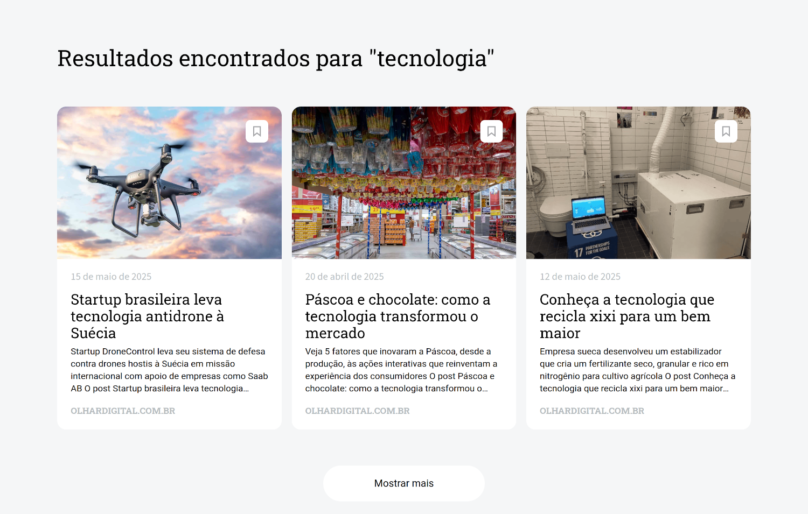
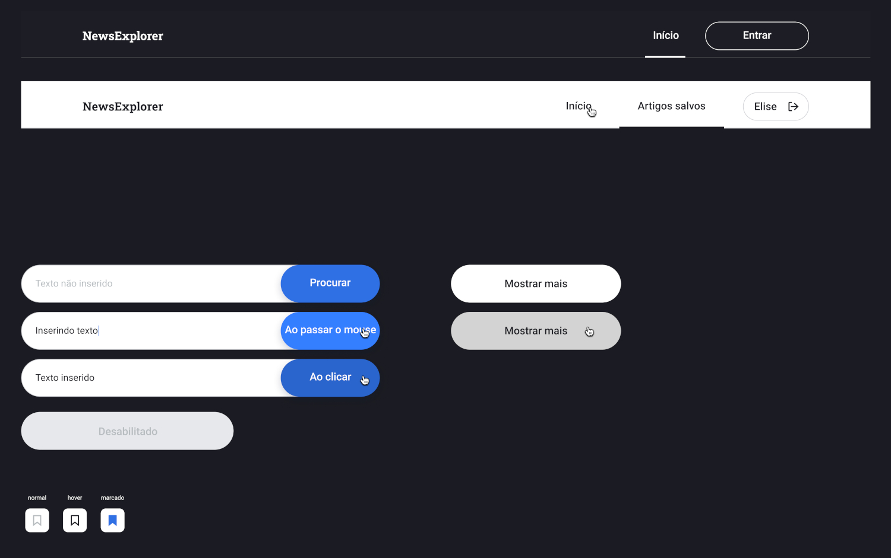
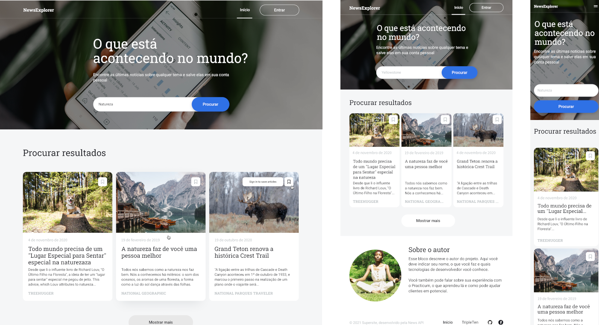
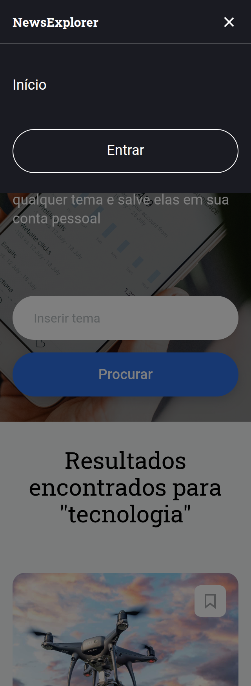
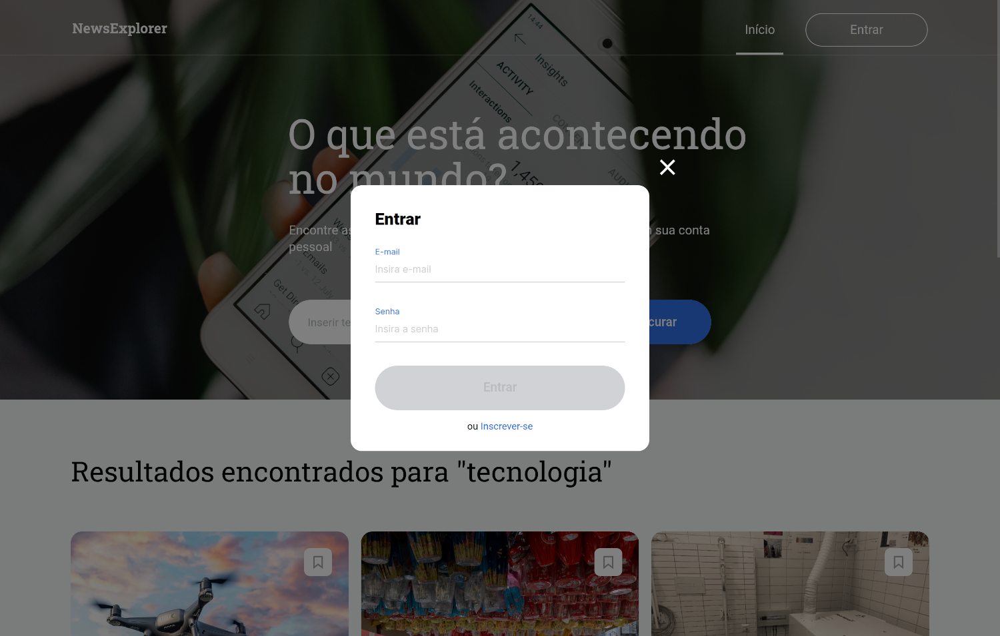
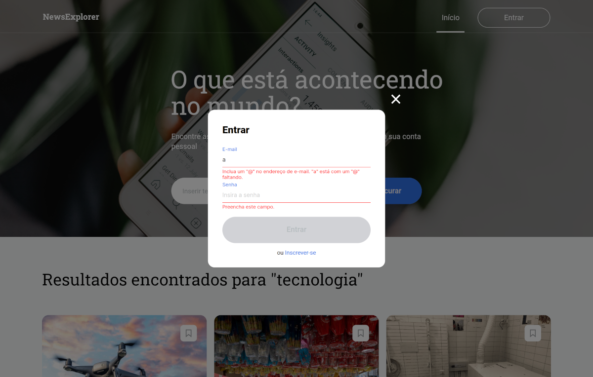
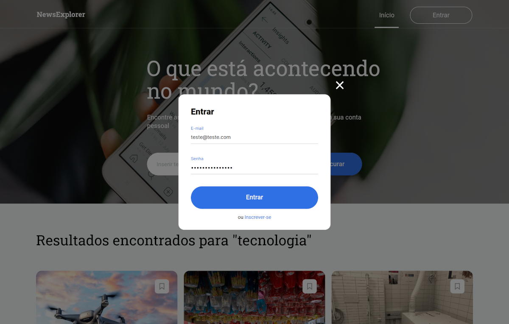
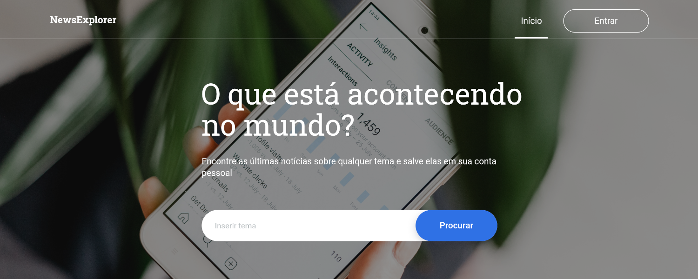
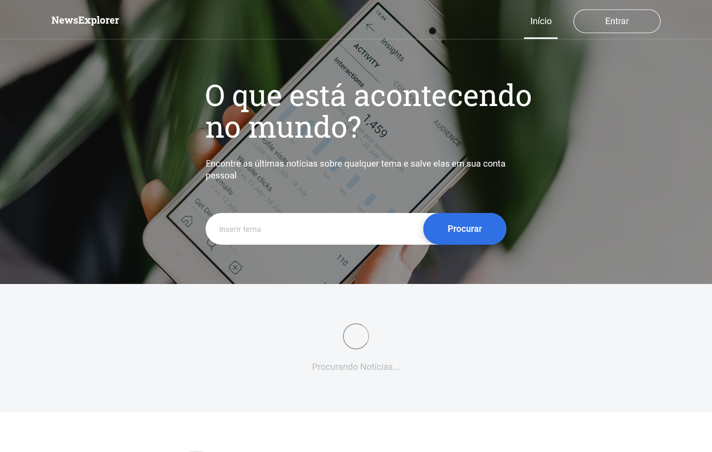
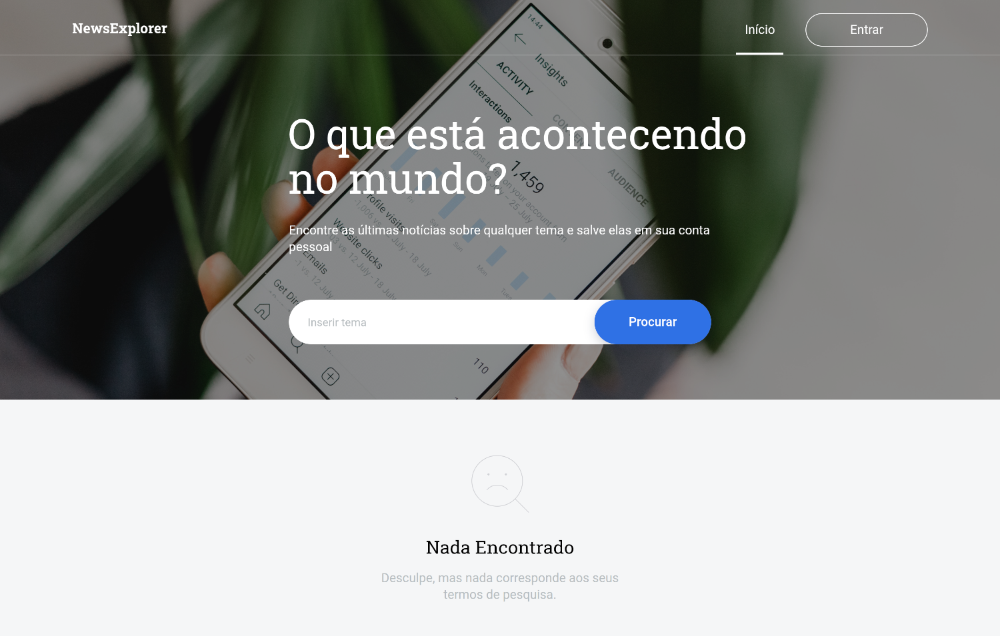

# NewsExplorer

O projeto **NewsExplorer** foi um aplicativo web que desenvolvi para permitir que usuários pesquisassem notícias sobre qualquer tema e salvassem os artigos de interesse em suas contas. Criei um layout responsivo que se adaptava a diferentes tamanhos de tela por meio de **unidades de medida relativas** e **media queries**, ajustando o design conforme os pontos de interrupção para garantir uma aparência consistente. Desenvolvi o projeto utilizando **React**, estruturando-o em componentes **JSX (JavaScript XML)**, com uma **API** de terceiros fornecendo as notícias.

**É possivel fazer o cadastro, login e salvar os artigos temporariamente, os dados só irão persistir ao finalizar o desenvolvimento o back-end. Confira o projeto em funcionamento clicando [aqui]().**

## Tecnologias e Metodologias

- HTML5 semântico
- Metodologia BEM
- Flexbox
- Grid
- Text-overflow
- Hover
- Pseudo-classe
- Unidades de medida relativas
- Media queries
- React JS
- API

## Descrição das Tecnologias e Técnicas Utilizadas

### HTML Semântico

Utilizei **HTML semântico** para tornar o código mais legível e acessível, facilitando a compreensão e a estruturação do conteúdo.

### Metodologia BEM

Adotei a **metodologia BEM** para facilitar a manutenção e escalabilidade do código, tornando a estrutura de classes mais clara.

### Flexbox

Apliquei `flexbox` em conjunto com **unidades de medida relativas** para organizar o layout e otimizar a responsividade, proporcionando uma boa experiência em diversos dispositivos.

### Grid e Text-overflow

Usei `grid` para estruturar os cartões de notícias e apliquei `text-overflow: ellipsis`, `overflow: hidden`, `line-clamp` e `white-space: nowrap` para truncar títulos e descrições que ultrapassavam o espaço disponível.

- Seção "News"

  

### Pseudo-classes

Implementei as **pseudo-classes** `:hover` e `:active` para melhorar a interatividade, alterando o estilo dos elementos em diferentes estados de interação.

### Media Queries

Configurei **media queries** para ajustar o layout em diferentes resoluções de tela, definindo pontos de interrupção específicos:

- 320-768px (540px)
- 768-1280px (1024px)
- 1280px ou superior

Incluí um botão hamburguer na barra de navegação para telas menores.

 

### React JS

Utilizei **React** com **JSX**, separando o código em componentes para melhor organização e reaproveitamento.

- **Popup para login e cadastro** – Implementei o `onClick()` para manipular o estado das popups com `useState()`. Usei `useEffect()` para adicionar um ouvinte de evento `keydown` e permitir fechar a popup com a tecla "esc", e o removi com `removeEventListener()` ao desmontar, utilizando `onChange()` e `onSubmit()` os dados são salvo temporariamente em um estado do `useState()`, permitindo fazer o login e salvar temporariamente os artigos, que serão perdidos ao atualizar a página (será possivel persistir os dados ao finalizar o backend).

   

- **Validação de formulário** – Instanciei uma classe dentro do `useEffect()` para validar os formulários, manipulando `useState()` para aprimorar a **UX**. A classe desabilitou o botão de **submit** quando havia entradas inválidas, realçando o campo e exibindo uma mensagem. O botão só era habilitado com os dados corretos.

   

- **Formulário de Busca** – Criei um formulário que, com `onChange()` e `onSubmit()`, armazena a palavra-chave para buscar artigos via **API**, retornando uma lista de notícias relevantes, que é armazeado em um estado para ser renderizado e armazenado no **localStorage** para caso o usuário saia da pagina ao voltar os resultados ainda estarem lá.

  

- **Preloader** – Implementei uma animação de carregamento controlada por `useState()`, exibida durante a busca e substituída pelos resultados ao término.

  

- **Cartões da seção news** – Usei `map()` para iterar sobre os dados e montar os cartões com `props`. Incluí botões para salvar artigos e para carregar mais notícias aos poucos (3 por vez), utilizando o método `.slice()` para encurtar a lista de acordo com o numero armazenado em um estado do `useState()` que aumenta conforme o botão é usado.

  

- **Cartões de erro e não encontrado** – Criei lógica para exibir mensagens alternativas caso não fossem encontrados artigos ou em caso de erro do servidor.

  
 

### API

Desenvolvi um módulo para consumir a **NewsAPI**, que retorna artigos com base em palavras-chave. Usei o método `fetch()` para fazer requisições **GET**, recebendo um **array** com os artigos mais relevantes.

## Planos de melhoria do projeto

- Desenvolver o backend com banco de dados para persistência.
- Criar uma API própria.
- Implementar registro e autenticação de usuários.
- Permitir salvar artigos e exibi-los após login.
